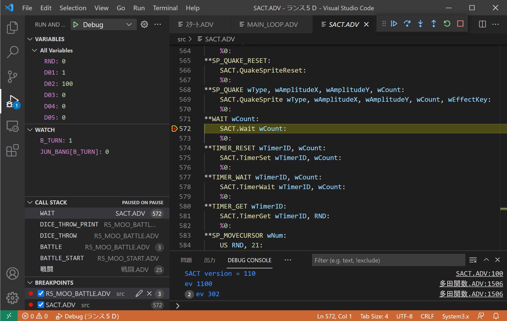

# System 3.x Extension for Visual Studio Code

This extension adds support for AliceSoft's System 1-3 and System 3.x languages.



## Features

- Syntax highlighting for `.adv` source files
- Decompiling and compiling:
  - System 3.x games (using the bundled [xsys35c])
  - System 1-3 games (using the bundled [sys3c])
- Debugging:
  - System 3.x games (using [xsystem35-sdl2])
  - System 1-3 games (using [system3-sdl2])

The following features are available for System 3.x games only:
- Documentation appears when you hover over a command name
- [Go to Definition](https://code.visualstudio.com/docs/editor/editingevolved#_go-to-definition) for functions

## Prerequisites

- For System 3.x features:
  - To view command documentation, you'll need the [System 3.9 SDK](https://web.archive.org/web/20021018163909/http://www.alicesoft.co.jp/support/sys39agr.html).
  - To use debugging features, you'll need [xsystem35-sdl2] (version 2.0.0 or higher).
- For System 1-3 features:
  - To use debugging features, you'll need [system3-sdl2] (version 1.3.0 or higher).

## Getting Started

After meeting the prerequisites, follow these steps to get started:

1. Install [this extension](https://marketplace.visualstudio.com/items?itemName=kichikuou.system3x).
2. Open a folder containing game files:
   - For System 3.x games: folder containing `*SA.ALD`
   - For System 1-3 games: folder containing `ADISK.DAT`
3. Open the command palette (<kbd>Ctrl</kbd>+<kbd>Shift</kbd>+<kbd>P</kbd> or
   <kbd>F1</kbd>), and enter `system3x`. Select `System3x: Decompile` from the
   list that appears. Decompiled source files will be saved in the `src`
   folder, and this extension will automatically open the first `.adv` file.
4. For debugging:
   - System 3.x games (using [xsystem35-sdl2]):
     - On Windows, copy `xsystem35.exe` to the same folder as the `*.ALD` files.
     - On other platforms, follow the installation instructions for [xsystem35-sdl2].
   - System 1-3 games (using [system3-sdl2]):
     - On Windows, copy `system3.exe` and its DLL files to the same folder as `ADISK.DAT`.
     - On other platforms, follow the installation instructions for [system3-sdl2].
5. Press <kbd>F5</kbd> to start debugging.

## Feature Details

### Decompiling

The `System3x: Decompile` command works with both System 3.x and System 1-3 games:
- For System 3.x: decompiles `*.ALD` and `System39.ain` files
- For System 1-3: decompiles `?DISK.DAT` and `AG00.DAT` files

in the workspace folder. The decompiled source files are saved in a `src`
subfolder.

### Compiling

By default, the `Start Debugging` command (<kbd>F5</kbd>) automatically
rebuilds the game using source files in the `src` folder.

To build the game without running it, use the `Run Build Task` command
(<kbd>Ctrl</kbd>+<kbd>Shift</kbd>+<kbd>B</kbd>) and choose `xsys35c: build`.

### Running

If a `launch.json` file doesn't exist, pressing <kbd>F5</kbd> will start
the appropriate game engine with default settings. But this works only when an
`.adv` file is open in the current tab.

To make <kbd>F5</kbd> consistently functional, or to customize launch settings,
select `Add Configuration` from the `Run` menu. This will generate a
`launch.json` file as follows:

```json
{
    "version": "0.2.0",
    "configurations": [
        {
            "type": "xsystem35",
            "request": "launch",
            "name": "Debug",
            "program": "${config:system3x.xsystem35Path}",
            "runDir": "${workspaceFolder}",
            "srcDir": "${workspaceFolder}/src",
            "logLevel": 2,
            "stopOnEntry": false,
            "preLaunchTask": "xsys35c: build"
        }
    ]
}
```

Mouse hovering over the attributes will display their descriptions.

For example, to launch the game without building it, comment out the
`"preLaunchTask": "xsys35c: build"` line.

### Debugging

Refer to the [Debugging](https://code.visualstudio.com/docs/editor/debugging)
documentation in VS Code to learn how to use the debugger.

The debugger supports the following operations for all games:
- [Breakpoints](https://code.visualstudio.com/docs/editor/debugging#_breakpoints)
- [Step-through execution](https://code.visualstudio.com/docs/editor/debugging#_debug-actions)
- [Data inspection](https://code.visualstudio.com/docs/editor/debugging#_data-inspection)
- Color palette viewer (in the Run and Debug View of the side bar)

Additional features for System 3.x games only:
- [Conditional breakpoints](https://code.visualstudio.com/docs/editor/debugging#_advanced-breakpoint-topics)
- [Debug console REPL](https://code.visualstudio.com/docs/editor/debugging#_debug-console-repl)

## Extension Settings

To access your settings, open the Settings editor (`Ctrl+,` or `Cmd+,`) and
search for `system3x`.


[xsys35c]: https://github.com/kichikuou/xsys35c
[sys3c]: https://github.com/kichikuou/sys3c
[xsystem35-sdl2]: https://github.com/kichikuou/xsystem35-sdl2
[system3-sdl2]: https://github.com/kichikuou/system3-sdl2
